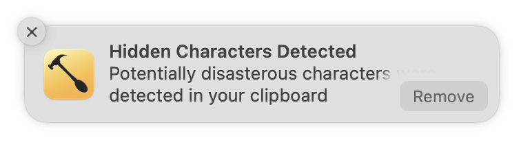

# Invisikill

A [Hammerspoon][hammerspoon] Spoon for macOS for detecting and removing invisible spaces and other gremlins from strings when you copy them. Invisible characters can ruin your code, your application, and your life. They can spread, so easily, copy and pasting, sticking around when you've thought you've deleted them. They are pernicious. They are the disease. Invisikill is the cure.

## Installation

1. Install [Hammerspoon][hammerspoon]
2. [Download this repo as a zip](https://github.com/Alazoral/invisikill/archive/refs/heads/main.zip)
3. Rename the folder to Invisikill.spoon
4. Move folder to your Hammerspoon spoon directory, usually `~/.hammerspoon/Spoons`
5. Open your Hammerspoon Config using the menu item
6. Add the following to your config:
   ```lua
   hs.spoons.use("Invisikill")
   spoon.Invisikill:start() 
   ```
7. Save and reload your config

## Usage

After configuration, Hammerspoon will check everything you copy to the clipboard, and if it matches the kill list, it will give you a notification that will give you the option to **Remove** the offenders. It's that simple. 



To make sure it's working, copy the following word to the clipboard: te​st

## Configuration

By default Invisikill will zap `\x00` through `\x7F`. You can customise that by setting the kill list or appending to it in your Hammerspoon Config.

### Reset the list

To reset the kill list to exactly your desire, just do this:

```lua
hs.spoons.use("Invisikill")
spoon.Invisikill.kill_list = {"fuck"}
spoon.Invisikill:start() 
```

That will ensure that you don't accidentally copy anything that includes the word "fuck", thus maintaining your milquetoast half-arsed glaze of professionalism that is preventing you from doing what you should be doing. It will let invisibles through though. Because you don't actually care. Burn it all down. As long as you look innocent they will never suspect a thing. Your exciting career in corporate sabotage begins here. You're welcome.


### Add to the list

To kill the existing config but just add to it, do this:

```lua
hs.spoons.use("Invisikill")
spoon.Invisikill.addKillList({"“", "”", "‘", "’"})
spoon.Invisikill:start() 
```

That will ensure you don't copy smart quotes. It won't make them dumb, though, it will just remove them. That is probably not what you're looking for. Your attempt at becoming smart has backfired. Look at you. You stood for the dumb quotes and you became dumb. You are dumb. You are all flat. The world around you is curling and you are just lying straight as a board. Are you dead or are you just having difficulty coping?


[hammerspoon]: http://www.hammerspoon.org